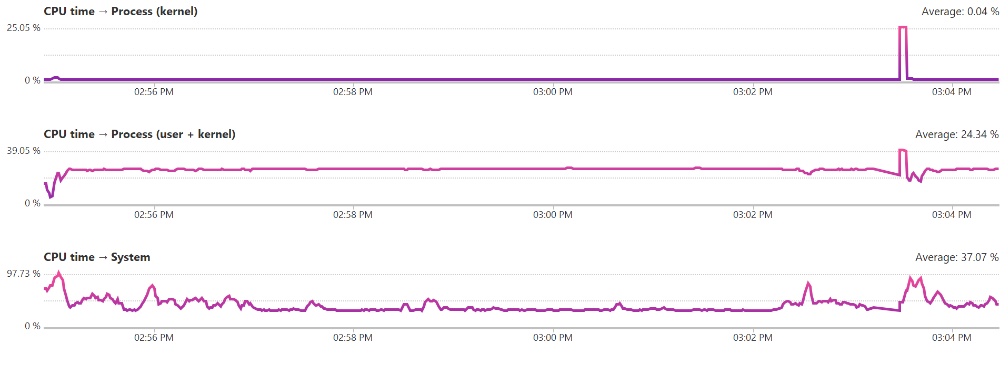
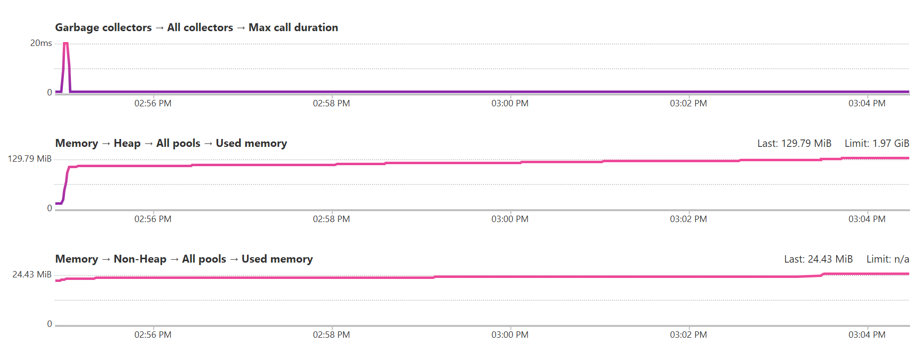
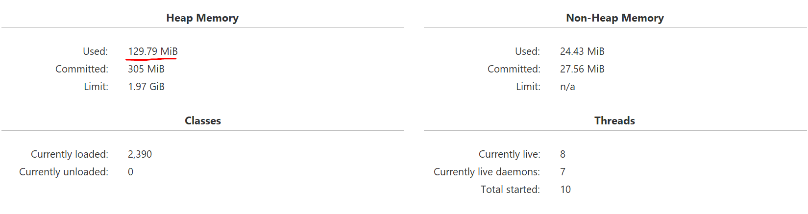
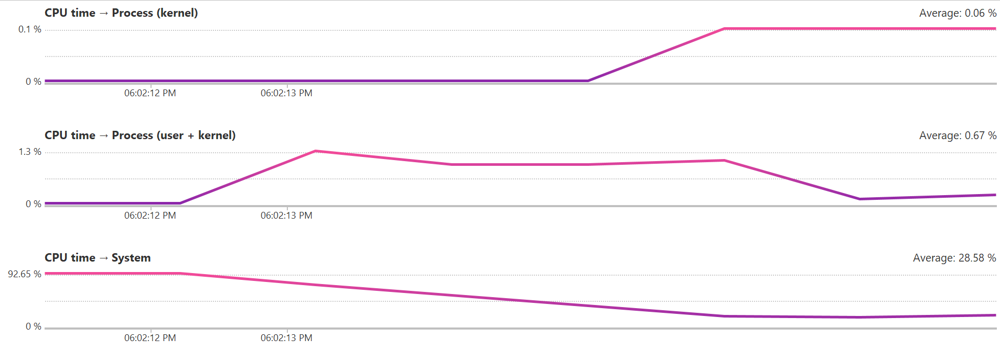
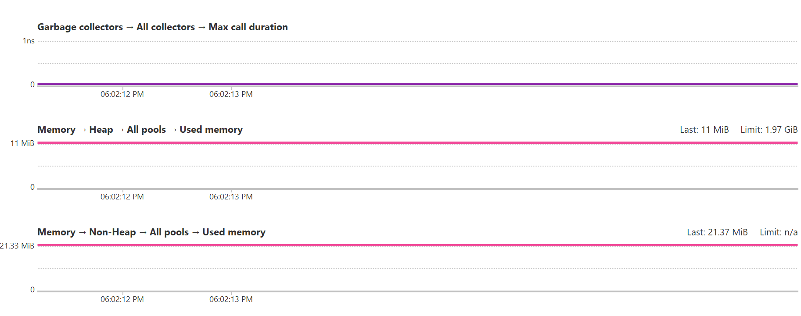
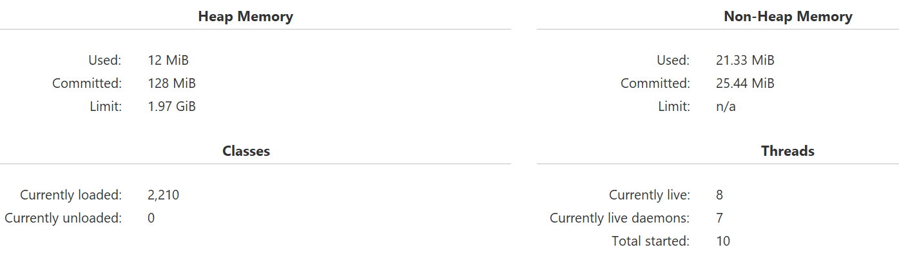
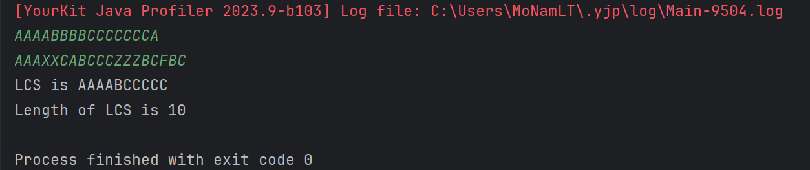

# گزارش آزمایش هشتم

محمد نامدار  ـــــ  حمیدرضا دهباشی

آدرس مخزن پروژه: https://github.com/hamiddeboo8/Software-Lab-Profiling

## گزارش پروژه

### بخش اول

حمید بزن

### بخش دوم

برای این قسمت تصمیم گرفتیم
[مسئله LCS](https://en.wikipedia.org/wiki/Longest_common_subsequence)
را به صورت پیاده کنیم.
به این صورت که برنامه، رشته مد نظر و طول آن را خروجی می‌دهد.

#### روش غیر بهینه

ابتدا به روش غیر بهینه brute force
، با تولید و مقایسه همه زیر دنباله های ممکن دو رشته ورودی پاسخ مسئله را پیدا میکنیم
که برای دو رشته ورودی با طول های 
$m$ و $n$
پیچیدگی زمانی 
$ O( 2^{m*n} ) $
دارد و کد پیاده سازی آن در 
[این کامیت](https://github.com/hamiddeboo8/Software-Lab-Profiling/commit/cc88cdff092f9022ddd58cbe61efaf3ab0b23e23)
قابل بررسی است.

با اجرا این کد روی دو رشته ورودی
$AAAABBBBCCCCCCCA$ و $AAAXXCABCCCZZZBCFBC$
را ورودی می‌گیرد
که بزرگ ترین زیر دنباله مشترک $AAAABCCCCC$ را دارند
و پروفایل کردن مصرف منابع پردازنده و حافظه برای برنامه، از طریق نرم‌افزار YourKit، به مقادیر زیر می‌رسیم.

Average CPU Usage : $24.34$ %

Memory Usage: $129.79 MB$

Runtime : More than $9 Mins$

<!-- زمان اجرا : پیش از ۹ دقیقه -->

#### روش بهینه

در روش دوم،‌ مسئله را با روش dynamic programming به شکل بهتر حل میکنیم.
کد مربوط به این قسمت را در
[کامیت optimize LCS code](https://github.com/hamiddeboo8/Software-Lab-Profiling/commit/32fbf9f9a527ba1b905003f8b16896647f5ea96a)
میتوان مشاهده کرد.

در این روش هم در مصرف حافظه و قدرت پردازشی سرفه‌جویی می‌شود و هم برنامه سریع تر اجرا می‌شود (برای آشنایی با ایده الگوریتمی پیاده‌سازی این روش می‌توانید به
[این لینک](https://en.wikipedia.org/wiki/Longest_common_subsequence#:~:text=.-,Code%20for%20the%20dynamic%20programming%20solution,-%5Bedit%5D)
 مراجعه کنید)

با اجرا کد جدید روی همان ورودی های قبلی به مقادیر زیر میرسیم.

Average CPU Usage : $0.67$ %

Memory Usage: $12 MB$

Runtime : Around $1 Sec$

همان طور که میبینیم هم مصرف منابع در حالت دوم بسیار بهتر است و هم اجرا برنامه بسیار سریع تر است.

شایان ذکر است snapshot پروفایل هر دو برنامه 
بعد از تمام شدن در فایل ‍‍`YourKit Snapshots`
موجود بوده و برای بررسی دقیق تر قابل استفاده است.

 
نمونه‌ای از اجرا برنامه:

