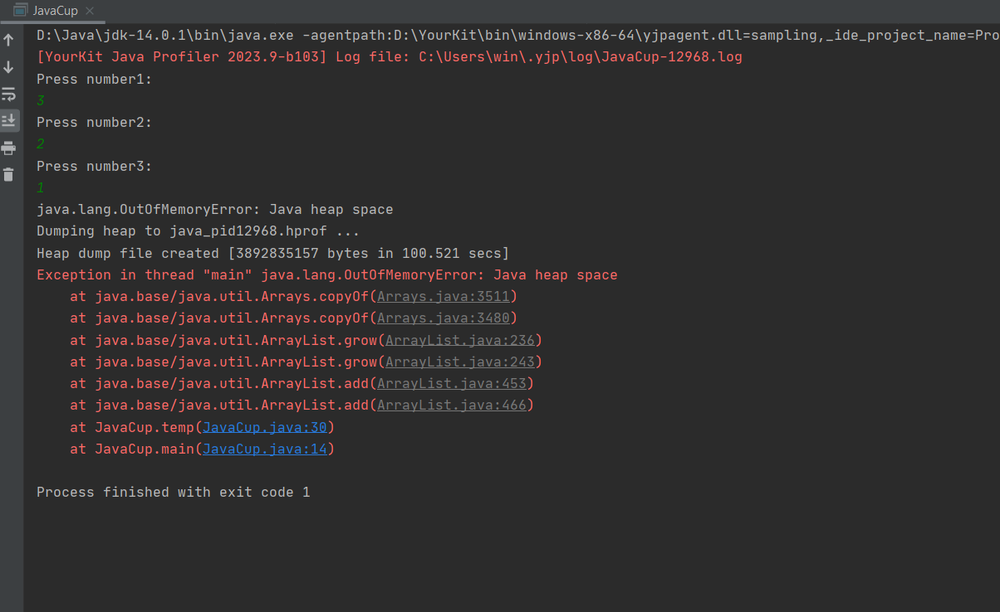
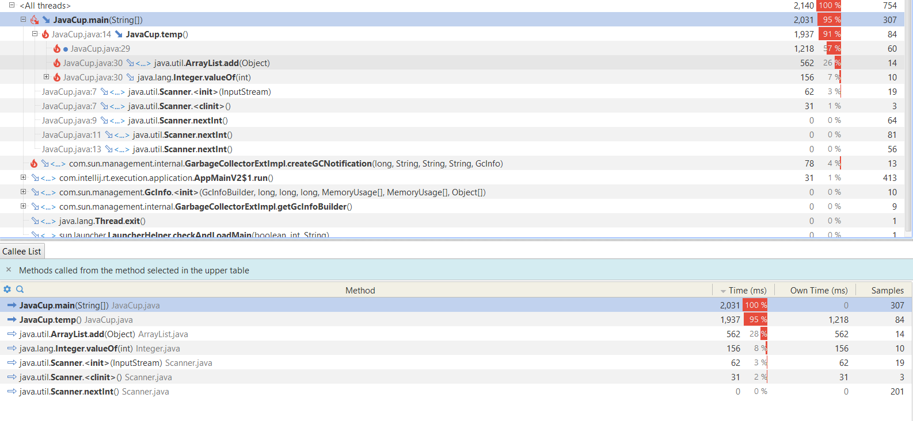
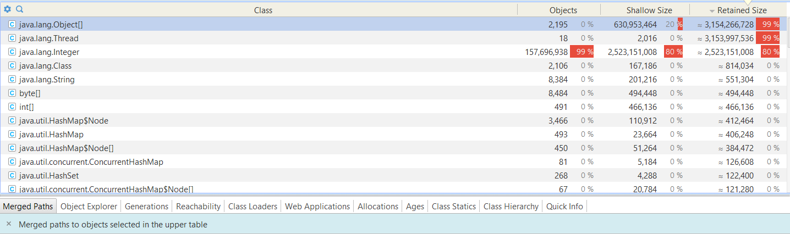
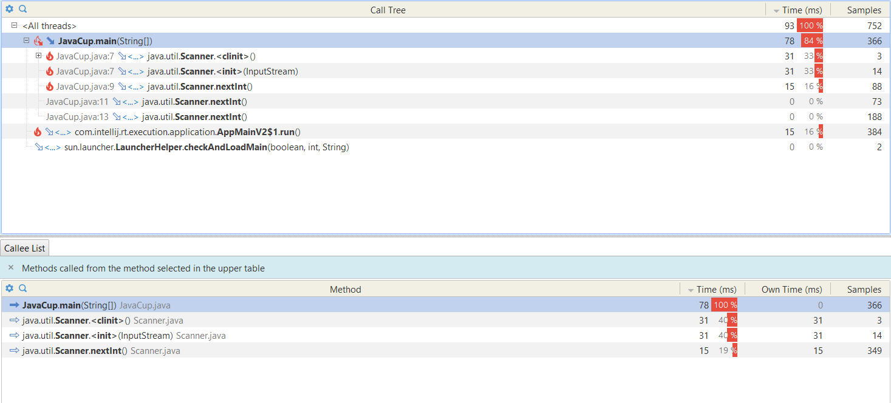

# گزارش آزمایش هشتم

محمد نامدار  ـــــ  حمیدرضا دهباشی

آدرس مخزن پروژه: https://github.com/hamiddeboo8/Software-Lab-Profiling

## گزارش پروژه

### بخش اول

در این قسمت باید برای پروژه JavaCup، تابعی را که بیش از بقیه توابع منابع مصرف می کرد شناسایی می کردیم و آن را بهبود می دادیم. به همین منظور ابتدا یک snapshot مربوط به این کلاس را گرفتیم.

با توجه به تصاویر بالا، خروجی برنامه به اینصورت بود که به دلیل استفاده بسیار زیاد حافظه، برنامه نتوانست تکمیل شود. همچنین بررسی زمانی نیز نشان می دهد که اکثر زمان برنامه در داخل تابع temp هستیم. با بررسی هایی که صورت گرفت به این نتیجه رسیدیم که به دلیل تولید تعداد زیادی عدد در این تابع و نگهداری آن ها، مشکل حاقظه نیز از همین تابع است. با توجه به کارکرد کلی برنامه که در آن 3 عدد را ورودی میگیرد و یک شرطی را در نسبت با آنها چک میکند و خروجی را نشان میدهد، این تابع به کل بلا استفاده خواهد بود بنابراین بهینه سازی این تابع با پاک کردن آن صورت میگیرد. این کار در کامیت [c34b76dfc9ab08cd854b3d53c9ef907ab3c1e689](https://github.com/hamiddeboo8/Software-Lab-Profiling/commit/c34b76dfc9ab08cd854b3d53c9ef907ab3c1e689) صورت گرفته است و تصاویر مربوط به پس از بهینه سازی را در زیر مشاهده میکنید.

همچنین مشکل memory نیز برطرف شد.

شایان ذکر است اگر تابع temp در جریان اصلی برنامه تاثیرگذار بود، آنگاه میتوانستیم از ایده هایی مانند استفاده از ساختار داده های مناسب تر جهت نگهداری دیتا استفاده کرد که در این سناریویی که داشتیم نیاز نشد. 

### بخش دوم

برای این قسمت تصمیم گرفتیم
[مسئله LCS](https://en.wikipedia.org/wiki/Longest_common_subsequence)
را به صورت پیاده کنیم.
به این صورت که برنامه، رشته مد نظر و طول آن را خروجی می‌دهد.

#### روش غیر بهینه

ابتدا به روش غیر بهینه brute force
، با تولید و مقایسه همه زیر دنباله های ممکن دو رشته ورودی پاسخ مسئله را پیدا میکنیم
که برای دو رشته ورودی با طول های 
$m$ و $n$
پیچیدگی زمانی 
$ O( 2^{m*n} ) $
دارد و کد پیاده سازی آن در 
[این کامیت](https://github.com/hamiddeboo8/Software-Lab-Profiling/commit/cc88cdff092f9022ddd58cbe61efaf3ab0b23e23)
قابل بررسی است.

با اجرا این کد روی دو رشته ورودی
$AAAABBBBCCCCCCCA$ و $AAAXXCABCCCZZZBCFBC$
را ورودی می‌گیرد
که بزرگ ترین زیر دنباله مشترک $AAAABCCCCC$ را دارند
و پروفایل کردن مصرف منابع پردازنده و حافظه برای برنامه، از طریق نرم‌افزار YourKit، به مقادیر زیر می‌رسیم.

Average CPU Usage : $24.34$ %

Memory Usage: $129.79 MB$

Runtime : More than $9 Mins$

<!-- زمان اجرا : پیش از ۹ دقیقه -->

#### روش بهینه

در روش دوم،‌ مسئله را با روش dynamic programming به شکل بهتر حل میکنیم.
کد مربوط به این قسمت را در
[کامیت optimize LCS code](https://github.com/hamiddeboo8/Software-Lab-Profiling/commit/32fbf9f9a527ba1b905003f8b16896647f5ea96a)
میتوان مشاهده کرد.

در این روش هم در مصرف حافظه و قدرت پردازشی سرفه‌جویی می‌شود و هم برنامه سریع تر اجرا می‌شود (برای آشنایی با ایده الگوریتمی پیاده‌سازی این روش می‌توانید به
[این لینک](https://en.wikipedia.org/wiki/Longest_common_subsequence#:~:text=.-,Code%20for%20the%20dynamic%20programming%20solution,-%5Bedit%5D)
 مراجعه کنید)

با اجرا کد جدید روی همان ورودی های قبلی به مقادیر زیر میرسیم.

Average CPU Usage : $0.67$ %

Memory Usage: $12 MB$

Runtime : Around $1 Sec$

همان طور که میبینیم هم مصرف منابع در حالت دوم بسیار بهتر است و هم اجرا برنامه بسیار سریع تر است.

شایان ذکر است snapshot پروفایل هر دو برنامه 
بعد از تمام شدن در فایل ‍‍`YourKit Snapshots`
موجود بوده و برای بررسی دقیق تر قابل استفاده است.

 
نمونه‌ای از اجرا برنامه:

